# The Simple Bootstrap Tutorial
### Anderson Evans

***Q: Who should find this tutorial useful?***
A: Everyone that isn't already familiar with styling their HTML pages

***Q: Who is REQUIRED to use this tutorial?***
A: Students that are submitting a single asset deliverable for their final
project.  This means anyone with a final project that is an animated gif,
a single image where the student has been studying image properties/colors/etc, or
a project that is concerned strictly with garnering a better understanding of styling
itself.

---

So first things first, let's talk about cascading style sheets or CSS.  CSS is
what makes our HTML pages look like something more than a white, straight-up-and-down
page with a Times font and images that are simply spaced between paragraphs of text.

CSS isn't the hardest thing to learn and comprehend, but it is one of the most
laborious tasks a web developer will find themselves dealing with.  In the past
developers were designing strictly for standard computer monitors, but since the
advent of mobile, trying to build an optimal site that would show up one way on
a computer monitor and a different way on a smart-phone and still another way on
a tablet made the laborious task of CSS design that much more time-consuming.

Enter the framework.  HTML/CSS/Javascript frameworks make the task of creating
a decent looking website for multiple devices much much easier.  By integrating
a framework into your design you can rapidly construct a website that looks quite
professional.

Because in this course we are sort of all over the board in terms of all the
different new and social media development practices we are looking at, spending
a lot of time on CSS isn't really an option.  I say this because some might suggest
a stronger hold over basic CSS concepts before jumping into the use of a framework
like bootstrap.  So to appease the voice in my head telling me, "You know this is
probably kind of true" here is a screenshot demonstrating use of a CSS stylesheet
at its most basic:

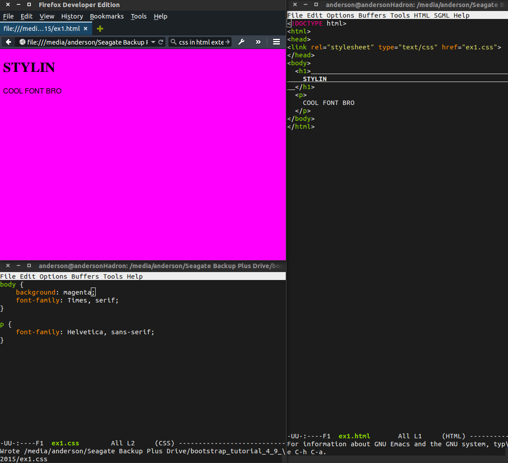

All I did there was change the pages background color and the text style.  The important
thing to notice is the call to the CSS stylesheet file:

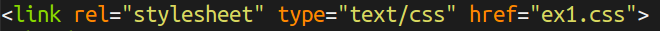

Just like with your image assets, your CSS stylesheet needs to be in the same folder
(or a folder WITHIN the folder) that your HTML file is in.  Now you probably don't have
your head completely wrapped around CSS and CSS syntax quite yet, but if you check out
the resources page linked to in our [blog's navbar](http://blogs.baruch.cuny.edu/newmedia2015/) you'll see there are several CSS
tutorials and resources to be found there.

For now I'm going to switch gears into practical mode.  I'm going to show you how to
integrate the bootstrap CSS (and javascript) with a ready-to-use HTML template structured
especially for use with bootstrap

There are two main sites we are going to be looking at:
1. [GetBootstrap.com](http://www.getbootstrap.com)
2. [StartBootstrap.com](http://www.startbootstrap.com)

GetBootstrap is the main source of information about Bootstrap's essential functions
and a source for downloading the CSS and Javascript files.  For what we're doing
today, this space will be most useful as a reference for building things like buttons and tables and the like when you start messing around
with Bootstrap on your own.

StartBootstrap is where we will be getting all of our resources for this tutorial.

First thing's first.  Go to
either your **Windows Explorer** or **Mac Finder**
file manager and create a new folder
called **Portfolio**.

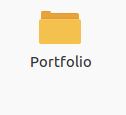

Now let's leave that folder alone for a second, but remember where we have saved it.  Now we'll navigate to StartBootstrap.com, click into 'Browse Themes and Templates'
and navigate down to the "Portfolio Item" template.  Click 'Preview and Download'

Now click on Download.

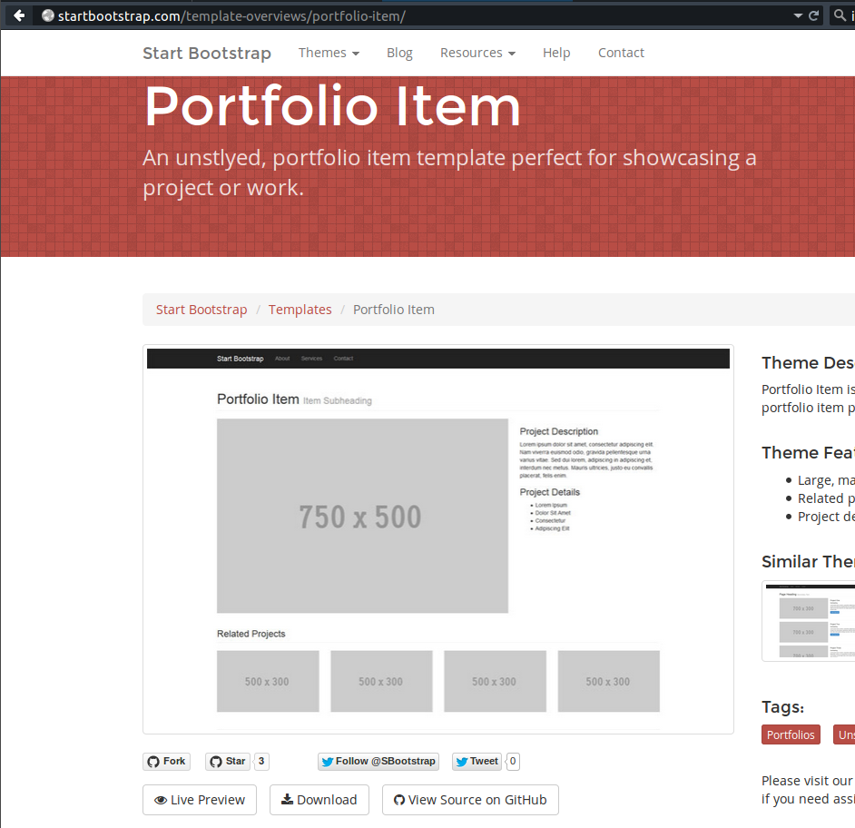

You will be asked to save a zip file.  Save that zipfile to the folder you created called **Portfolio**.  If you are forced to save to a different location, find the downloaded zip file, and drag it into your **Portfolio** folder.  Now unzip the file.

The inside of your **Portfolio folder** should now look something like this:

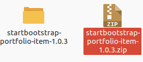

Now when you open the new folder you should see something like this:

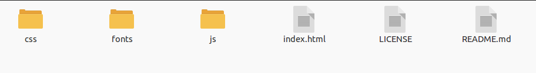

Now remember earlier when I showed you that very
simple CSS file?  Well, instead of us having to build on that near empty template, we now have the power of bootstrap attached to a very nicely marked up html document.  Because we understand the basics of HTML from class, we should be able to edit the index.html file, linked to bootstrap's CSS (and Javascript as well).  Discussing the functionality of Javascript is beyond what I want you all to worry about in the context of this tutorial, just know that your HTML document calls to it much like it does to CSS, but instead of using the Javascript for style, your bootstrap enabled page uses Javascript for functionality.

If you are interested in Javascript I recommend [THIS INTRODUCTION TO JAVASCRIPT](http://cs.lmu.edu/~ray/notes/javascript/).

So let's open the entire folder up in atom.

Now I'm going to select the `index.html` file from the sidebar.

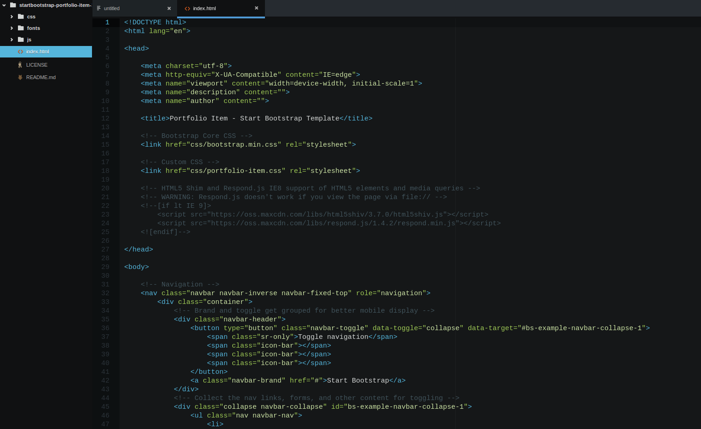

This is far more complex than the CSS we looked at earlier, and includes CSS selectors like classes and divs which we have not discussed at length.  If you want to dig more into this topic [TRY THIS ARTICLE](https://css-tricks.com/how-css-selectors-work/).

Now back to the task at hand, setting up our Bootstrap page.  I'm going to just load the HTML as it is written, to make sure my download went as smoothly as I think it did.

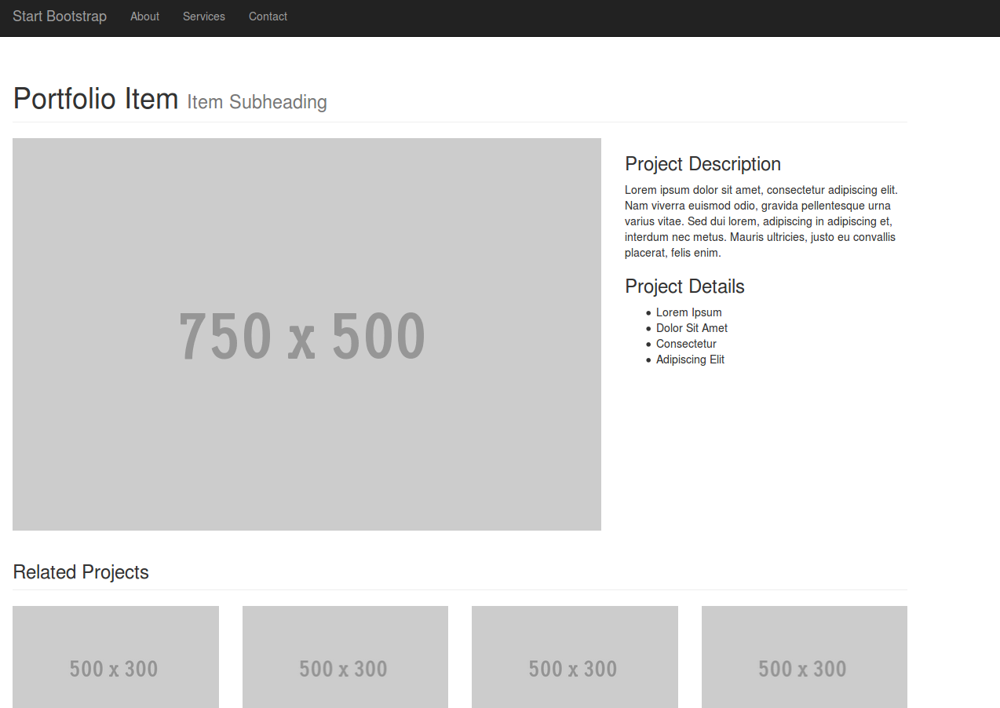

Success!  I get a working .html document that is responsive (meaning it was created with dynamic sizing for multiple devices), now we just have to swim through the HTML in atom and replace the placeholder assets and copy with our own.

For the tutorial I will change the main picture, I will leave the rest for you to figure out on your own.

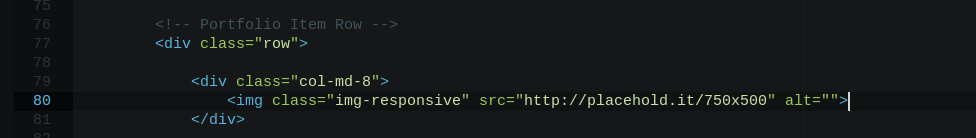

I've found where the templated `index.html` is linking to a 750X500 placeholder image, I'm going to now open Gimp and create an image at 750X500 pixels.

Here is a picture that proves I was an extra on a TV show with Harvey Keitell and that dude from The Sopranos... so I'm not sweating it either.  But I digress...

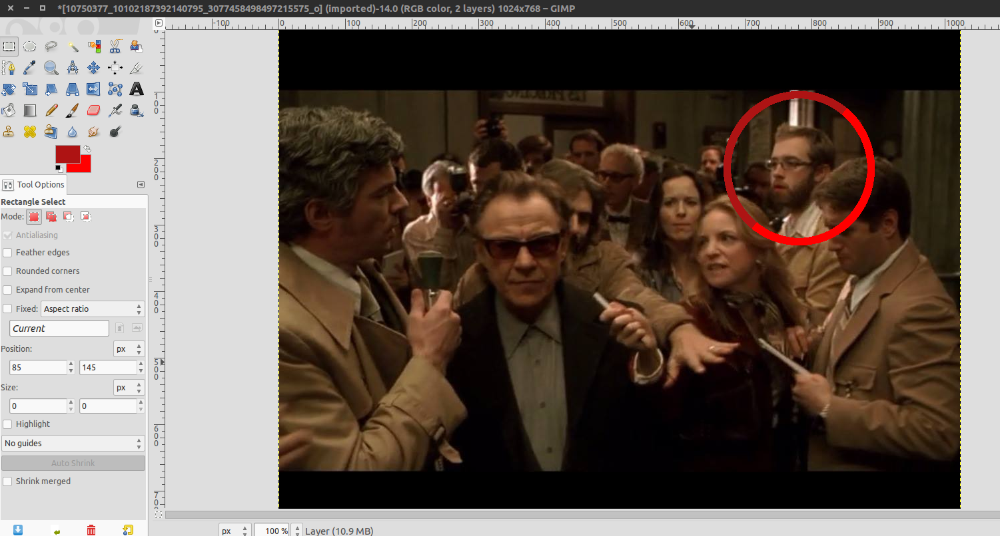

What I want to do now is size my canvas to 750px X 500px.  So I just go up to the Gimp navigation bar, select **Image** then find **Canvas Size** and change the size of my canvas.

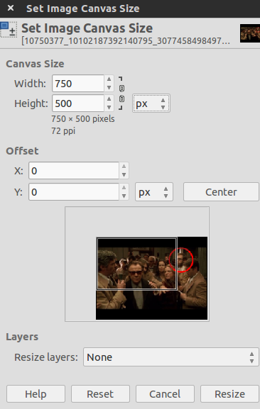

Now I need to resize the image so that it fits inside my canvas.  I want to use the **Scale Tool**

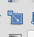

Now I can size the image to my desired dimensions.

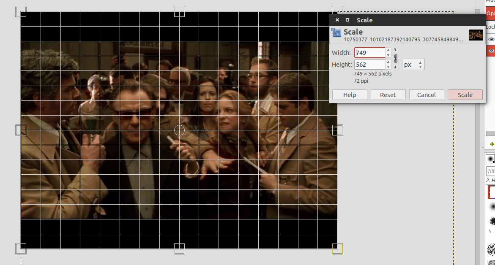

Now I've got my optimized photo, I'll just head back up to Gimp's navbar and select **File** then **Export As** and I will save my image as `mainImage.png`  I will save this image to the same directory (the bootstrap folder) that my `index.html` file is in.

Now I'm going back to that `index.html` file in Atom, and I'm going to link my newly sized image to the main portfolio image space.

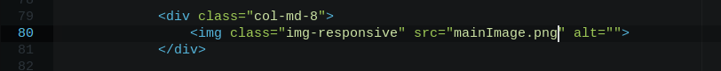

Now let's save over the index.html file, and move back to our browser.  We should see our image inserted where the "750 X 500" placeholder was the last time we looked.

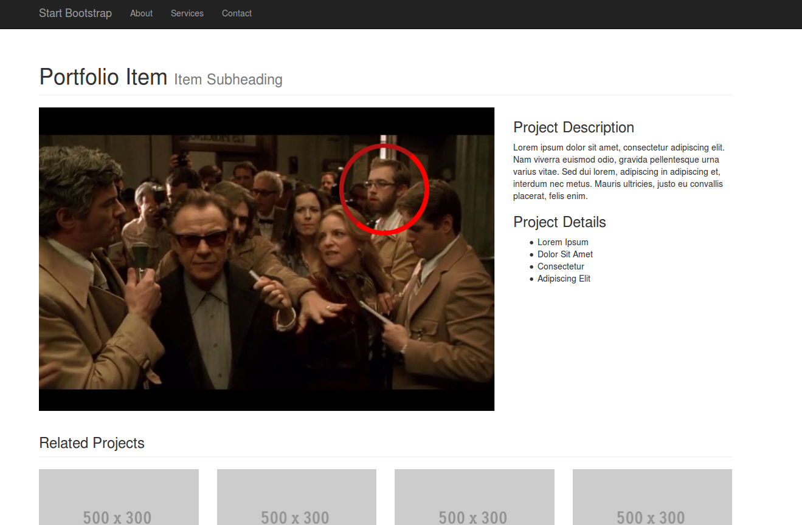

It worked for me!  Did it work for you?  If so you are well on your way to designing some really professional looking web pages.  Having trouble?

Here are 3 more tutorials on Bootstrap you might find useful, if you are having trouble.

---

1. [*Twitter Bootstrap Tutorial - Handling Complex Designs* by Syed Fazle Rahman](http://www.sitepoint.com/twitter-bootstrap-tutorial-handling-complex-designs/)

2. [*Twitter Bootstrap 101: Introduction* by David Cochran](http://webdesign.tutsplus.com/tutorials/twitter-bootstrap-101-introduction--webdesign-5459)

3. [*Step by Step Bootstrap for Beginners* by Mike Dalisay](https://www.codeofaninja.com/2014/05/bootstrap-tutorial-beginners-step-step.html)
